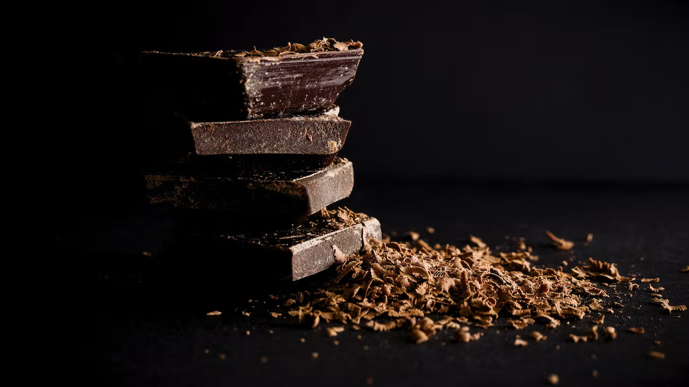

# Chocolate-Bar-Ratings

Source of the Dataset: https://www.kaggle.com/datasets/rtatman/chocolate-bar-ratings

Read the Article: http://rpubs.com/rkellazar/chocolate-bar-ratings

## Context

Chocolate is one of the most popular candies in the world. Each year, residents of the United States collectively eat more than 2.8 billions pounds. However, not all chocolate bars are created equal! This dataset contains expert ratings of over 1,700 individual chocolate bars, along with information on their regional origin, percentage of cocoa, the variety of chocolate bean used and where the beans were grown.

## Analysis Questions:

- Where are the best cocoa beans grown?
- Which countries produce the highest-rated bars?
- What’s the relationship between cocoa solids percentage and rating?
